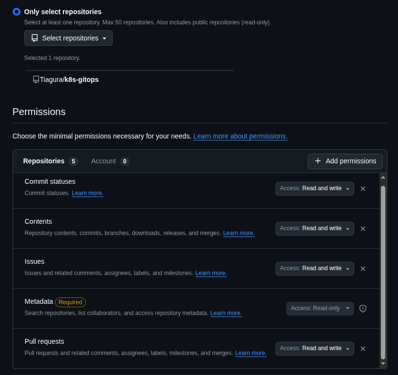
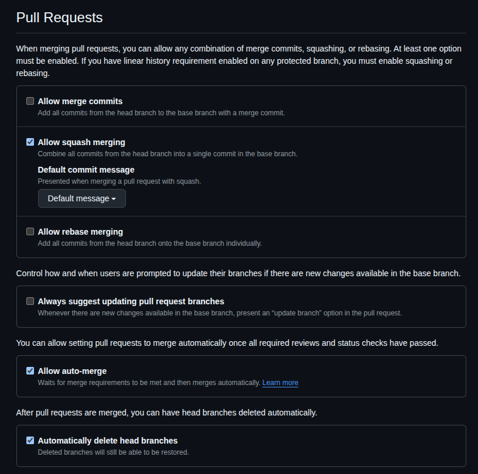
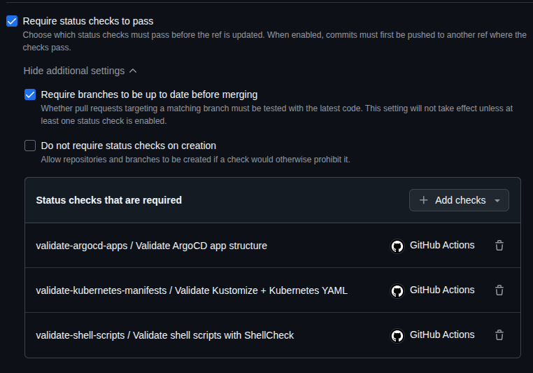

# Renovate (Self-Hosted)

This repository uses a self-hosted instance of Renovate running as a Kubernetes `CronJob` to keep dependencies up to date in a GitOps workflow.

## Overview

Renovate acts as the first step in the CI/CD pipeline, detecting dependency updates and automatically creating pull requests to update them.

- Runs as a Kubernetes `CronJob`
- Targets only this repo
- Platform: GitHub

## Table of contents

- [Renovate (Self-Hosted)](#renovate-self-hosted)
  - [Overview](#overview)
  - [Table of contents](#table-of-contents)
  - [Configuration & Behavior](#configuration--behavior)
  - [Update Strategy](#update-strategy)
  - [GitHub Setup for Renovate](#github-setup-for-renovate)
    - [Access Token (PAT)](#access-token-pat)
    - [Repository Setup](#repository-setup)
      - [General Settings](#general-settings)
      - [Branch Protection Rule](#branch-protection-rule)

## Configuration & Behavior

Renovate is configured to:
- Interact with GitHub and this repo **only** (no autodiscovery, explicit repository targeting)
  ```json
  {
    "platform": "github",
    "autodiscover": false,
    "repositories": ["Tiagura/k8s-gitops"]
  }
  ```
- PR creation is limited to 5 per hour to avoid overloading ArgoCD and causing large reconciliation waves
  ```json
  {
    "prHourlyLimit": 5
  }
  ```
- Scheduled during night hours to minimize user impact during cluster reconciliation

- Rebases PRs automatically when they fall behind the base branch
  ```json
  {
    "rebaseWhen": "behind-base-branch"
  }
  ```

- Dependency Dashboard enabled for visibility
  ```json
  {
    "dependencyDashboard": true
  }
  ```

## Update Strategy

The strategy update is as follows:

- Patch/minor updates: pull request automerge
- Major updates: pull request created and manual review
- Minimum release age is 7 days to avoid early bugs; if no release date exists the update proceeds anyway
- Critical infrastructure is never automerged, including:
    - ArgoCD
    - Cilium
    - CloudNativePG and CNPG databases
    - Longhorn
    - OpenEBS
- Database related applications are never automerged for minor/major updates

## GitHub Setup for Renovate

Renovate is configured with `platformAutomerge: true`, meaning it relies on GitHub’s native auto-merge instead of Renovate’s internal merge handling.

Because of that, several GitHub-side configurations are required to ensure automerge works correctly.

### Access Token (PAT)

Create a [GitHub Personal Access Token](https://github.com/settings/personal-access-tokens) with repo-scoped access only to the repositories Renovate should manage.

Required permissions:
- Commit statuses: Read and write
- Contents: Read and write
- Issues: Read and write (if `"dependencyDashboard": true`)
- Pull requests: Read and write

<div align="center">
  
</div>

### Repository Setup

#### General Settings

In Settings -> General -> Pull Requests:
- Enable Auto-merge
- (Optional) Enable Automatically delete head branches

These allow GitHub to actually perform merges when Renovate marks PRs as ready.

<div align="center">
  
</div>

#### Branch Protection Rule

Create a branch protection rule for `main` with:

##### Required settings:
- Require a pull request before merging
- Require status checks to pass before merging
  - Require branches to be up to date before merging

##### Status checks

For Require status checks to pass before merging, you must explicitly select which checks are required in the branch protection rule.

Add the GitHub Actions workflows you use for validation (CI, lint, tests, etc.). These are the checks GitHub will enforce before allowing merges.

<div align="center">
  
</div>

If you don’t have real checks yet:
- You must still define at least one workflow
- A dummy GitHub Action can be used to satisfy this requirement

##### Bypass Rules

Add trusted users (e.g. you) to the bypass list to allow direct pushes to main when needed, without requiring pull requests.
