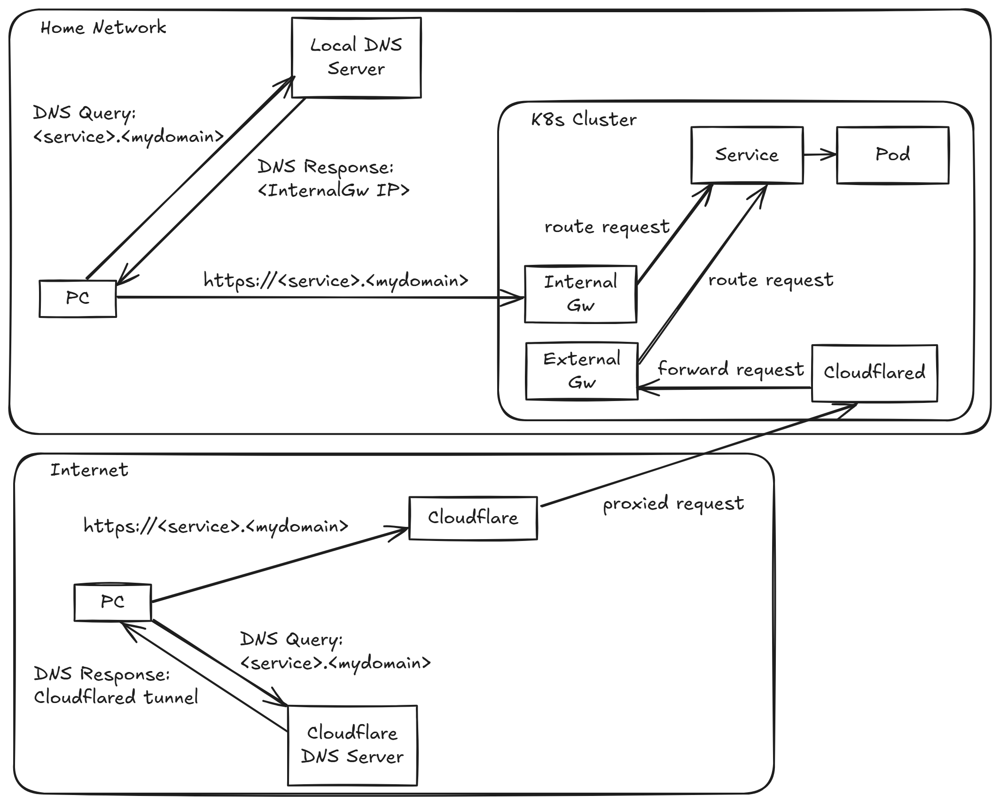

# Network Configuration

## Table of contents
- [Network Configuration](#network-configuration)
  - [Table of contents](#table-of-contents)
  - [Declarative Setup](#declarative-setup)
  - [Directory Structure](#directory-structure)
  - [Components](#components)
    - [Cilium \& Gateway API](#cilium--gateway-api)
    - [Cloudflare Tunnel](#cloudflare-tunnel)
    - [ExternalDNS](#externaldns)
  - [IP Allocations](#ip-allocations)
  - [DNS Configurations](#dns-configurations)
    - [Local DNS Server Mapping](#local-dns-server-mapping)
    - [ExternalDNS and CLoudflare DNS Server Mapping](#externaldns-and-cloudflare-dns-server-mapping)
      - [How it works](#how-it-works)
  - [Network Flow Overview](#network-flow-overview)
    - [Security](#security)
  - [Validate Setup](#validate-setup)
    - [Cilium Status](#cilium-status)
    - [Gateway Routing](#gateway-routing)
    - [Cloudfalre Tunnel](#cloudfalre-tunnel)
    - [ExternalDNS](#externaldns-1)

## Declarative Setup
All networking components described in this document — **Cilium**, **Gateway API**, **ExternalDNS**, and **Cloudflare Tunnel** — are deployed declaratively through the infrastructure ApplicationSet. No manual helm or kubectl commands are required.
Their manifests are stored under infrastructure/networking/ and are automatically synchronized by Argo CD to maintain a consistent and version-controlled network configuration.

## Directory Structure

```plaintext
infrastructure/networking/
├── cilium/           # Cilium Helm values, L2/LB policies, VIPs
├── gateway/          # Gateway API resources (Gateways, HTTPRoutes)
├── cloudflared/      # Cloudflare Tunnel manifests and secrets
├── external-dns/     # DNS synchronisation and automation to Cloudflare
└── kustomization.yaml
```

## Components

### Cilium & Gateway API
- Cilium serves as the CNI, service mesh, and Gateway API implementation.
- Gateway API handles ingress and L4/L7 traffic routing, fully managed by Cilium.
- All Cilium and Gateway API configurations are managed through ArgoCD.
- VIPs, L2/LB policies, and IP pools are defined in manifests and automatically synchronized by ArgoCD.

### Cloudflare Tunnel

### ExternalDNS

## IP Allocations

- **Home Network**:
  - Network: `192.168.1.32/29`
  - Usable Range: `192.168.1.34` to `192.168.1.37` 
  - Cilium Ingress Controller (Disabled): `192.168.1.34`
  - Internal Gateway: `192.168.1.35`
  - External Gateway: `192.168.1.36`
  - Spare: `192.168.1.37`
  
- **Pod Network**:
  - Services: `10.32.0.0/16`

- **Control Plane**:
  - API Server VIP: `entry.home.arpa` (IP `192.168.1.26`, change at will just update the DNS record `entry.home.arpa` points to)

## DNS Configurations

This setup uses a **split-horizon DNS** approach — meaning internal and external clients receive **different DNS responses** for the same domain depending on where the query originates.

- **Local DNS Server (Internal Zone)**: Manually managed. It resolves `<service>.<mydomain>` records to the **Internal Gateway** for devices on the home network. This allows internal access without routing through Cloudflare or the public internet.

- **Cloudflare DNS (External Zone)**: Managed automatically by the **ExternalDNS** component. It creates and updates public DNS records in Cloudflare for services exposed via the **External Gateway**.
These records point to the **Cloudflare Tunnel endpoint**, ensuring secure external access to designated services.

This split configuration allows local devices to connect directly within the LAN, while external users are routed securely through Cloudflare. An example of this can be seen in the [diagram](#network-flow-overview) 

### Local DNS Server Mapping
Manually Managed. Use:

| Hostname              | IPs            | Description                            |
| --------------------- | -------------- | -------------------------------------- |
| `entry.home.arpa`     | `192.168.1.26` | Control-plane / API server VIP         |
| `k8s-gateway`         | `192.168.1.35` | Internal Gateway endpoint              |
| `k8s-gateway-external`| `192.168.1.36` | External Gateway endpoint (not needed) |
| `<service>.<mydomain>`| `k8s-gateway`  | This is a CNAME Record                 |

### ExternalDNS and CLoudflare DNS Server Mapping

The `external-dns` component automates DNS record management for services exposed through the **Gateway API**.
It continuously monitors `HTTPRoute`, `TLSRoute`, `TCPRoute`, and `UDPRoute` resources, then creates or updates corresponding DNS records in Cloudflare based on the route hostnames.

#### How it works

- **Source Integration**: ExternalDNS watches Gateway API resources for any hostname definitions.
- **Filtering**: Only routes labeled with `app=gateway-external` are processed, ensuring that only externally exposed routes are published to Cloudflare DNS. This ensures that only resources associated with the **External Gateway** are published to Cloudflare DNS.
- **DNS Record Target**: The target of the DNS records created by ExternalDNS is defined in the **external Gateway manifest** using an annotation such as:
    ```bash
    annotations:
    external-dns.alpha.kubernetes.io/target: tunnel.tamhomelab.com
    ```
    > **Note**: To avoid exposing your actual **Cloudflare Tunnel UUID**, you can first create a Cloudflare DNS record (e.g., `tunnel.tamhomelab.com`) that points to your tunnel’s UUID hostname. ExternalDNS will then reference `tunnel.tamhomelab.com` as the public target, keeping the real tunnel identifier private while still routing traffic correctly.

## Network Flow Overview



The diagram above illustrates how traffic is routed, both internally (on the home network) and externally on the global internet (through Cloudflare).

- **Internal Access**: When a device on the home network queries `<service>.<mydomain>`, the **local DNS server** resolves the hostname to the Internal Gateway IP (`k8s-gateway`). The request is routed through the **Internal Gateway** to the appropriate Kubernetes Service and Pod.
- **External Access**: When accessing from the internet, the **Cloudflare DNS** server resolves `<service>.<mydomain>` to the **Cloudflare Tunnel endpoint** (thanks to `external-dns`). Traffic is then **securely proxied through Cloudflare**, forwarded via the **hosted Cloudflared tunnel**, and routed internally through the **External Gateway** to reach the same service inside the cluster.

### Security

Even though the external DNS record that points to the **Cloudflare Tunnel** is public, the cluster itself stays protected.
All external traffic from **Cloudflare** is sent only to the *External Gateway**, which is configured to expose specific services through defined routes (`HTTPRoute`, `TLSRoute`, etc.).

This design ensures that:
- Only services that you **explicitly expose** through the **External Gateway** are accessible from the internet.
- Any other service in the cluster remains **private and unreachable** from outside your home network.
- Even using the exposed tunnel endpoint, only the exposed services can be reached — for example, someone accessing `<exposed-service1>.<mydomain>` cannot pivot to reach `<internal-service>.<mydomain>` or any other non-exposed workloads.

In short, the **External Gateway** acts as a controlled entry point — it allows access only to what you’ve defined, keeping the rest of the cluster isolated.

> **Note**: For stronger security, you can enable mTLS on Cloudflare, apply Kubernetes NetworkPolicies to restrict pod traffic, or add authentication (OAuth, SSO, etc.) to your exposed services.

## Validate Setup

### Cilium Status

```bash
# Check Cilium Status
cilium status

#Check Cilium Connectivity
cilium connectivity test
```

### Gateway Routing

```bash
# Check gateway status
kubectl get gateway -A

# Test routes
kubectl get httproute -A
```

### Cloudfalre Tunnel

```bash
# Check tunnel pods
kubectl get pods -n cloudflared

# Check tunnel logs
kubectl logs -n cloudflared -l app=cloudflared
```

### ExternalDNS

```bash
# Check pod status
kubectl get pods -n external-dns

# Check pod logs
kubectl logs -n external-dns -l app=external-dns
```
